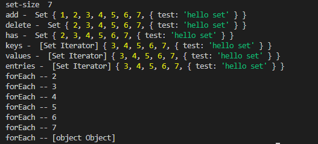
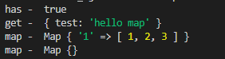

###	认识Set和Map数据结构

> 使用ES6进行开发成为了主流，对于ES6中的各种新语法，需要好好的学习一番

### Set

1. **Set**是ES6提供的一种新的数据结构，它允许你存储任何类型的值，但是值是唯一的，彼此之间出现重复的情况。 Set 本身是一个构造函数，用来生成Set数据结构的。

2. Set的参数可以是数组或是具有iterable接口的其他数据结构来作为初始化。

3. Set的属性和方法

   1. Set的属性：

   + `Set.prototype.constructor`: 构造函数，默认就是`Set`函数。
   + `Set.prototype.size`：返回`Set`实例的成员总数。

   2. Set的操作方法：

   - `add(value)`：添加某个值，返回 Set 结构本身。
   - `delete(value)`：删除某个值，返回一个布尔值，表示删除是否成功。
   - `has(value)`：返回一个布尔值，表示该值是否为`Set`的成员。
   - `clear()`：清除所有成员，没有返回值。

   - `keys()`：返回键名的遍历器
   - `values()`：返回键值的遍历器
   - `entries()`：返回键值对的遍历器
   - `forEach()`：使用回调函数遍历每个成员

4. Set实例代码如下：

```js
let set = new Set([1, 2, 3, 4, 5, 6, 7]);
console.log('set-size ', set.size);
set.add({ test: 'hello set' });
console.log('add - ', set);
set.delete(1);
console.log('delete - ', set);
set.has(3);
console.log('has - ', set);
console.log('keys - ', set.keys());
console.log('values - ', set.values());
console.log('entries - ', set.entries());
set.forEach(item => {
  console.log(`forEach -- ${item}`);
});
```



**tips**	:  由于 Set 结构没有键名，只有键值（或者说键名和键值是同一个值），所以`keys`方法和`values`方法的行为完全一致，而entries方法返回的遍历器，同时包含键名和值，所以每次输出一个数组，它的两个成员完全相等。

5. Set结构中的值唯一的特点，可以很好的实现数组的去重

```js
[...new Set([1,2,3,4,3,2])]; //[1,2,3,4]
```

6. 使用Set可以很容易实现交集、并集和差集

```js
let s1 = new Set([1,2,3,4,5]);
let s2 = new Set([3,2,5,8,9]);
//并集
let union = new Set([...s1, ...s2]); // Set { 1, 2, 3, 4, 5, 8, 9 }
//交集
let intersect = new Set([...s1].filter(item => s2.has(item))); // Set { 2, 3, 5 }
//差集
let difference = new Set([...s1].filter(item => !s2.has(item)));// Set { 1, 4 }
```

###	WeakSet

WeakSet 与 Set的结构类似，但是有两点不同：

1. WeakSet的成员只能是对象
2. WeakSet中的对象是弱引用

### Map

> JavaScript 的对象（Object），本质上是键值对的集合（Hash 结构），但是传统上只能用字符串当作键。这给它的使用带来了很大的限制。

> **Map** 类似于对象，也是键值对的集合，但是“键”的范围不限于字符串，各种类型的值（包括对象）都可以当作键。也就是说，Object 结构提供了“字符串—值”的对应，Map 结构提供了“值—值”的对应，是一种更完善的 Hash 结构实现。如果你需要“键值对”的数据结构，Map 比 Object 更合适。
>
> Map的键实际上是跟内存地址绑定的，只要内存地址不一样，就视为两个键，这就解决了同名碰撞的问题。

###	Map的属性和方法

1. `size属性`：返回成员总数
2. `set(key, value)`: 设置键名`key`对应的键值为`value`， 返回整个Map结构
3. `get(key)`: 返回对于的键值
4. `has(key)`: 返回布尔值，表示是否在Map对象中
5. `delete(key)`: 删除某个键，返回布尔值
6. `clear()`: 清空Map对象
7. `keys()`：返回键名的遍历器。
8. `values()`：返回键值的遍历器。
9. `entries()`：返回所有成员的遍历器。
10. `forEach()`：遍历 Map 的所有成员。

参考代码如下：

```js
const mapTest = new Map(); //创建一个map数据结构
mapTest.set(Symbol.for('a'), { test: 'hello map' });
console.log('has - ', mapTest.has(Symbol.for('a')));
console.log('get - ', mapTest.get(Symbol.for('a')));
mapTest.set('1', [1,2,3]);
mapTest.delete(Symbol.for('a'));
console.log('map - ', mapTest);
mapTest.clear();
console.log('map - ', mapTest);
```



### WeakMap

> 1. WeakMap`结构与`Map`结构基本类似，唯一的区别是它只接受对象作为键名（`null`除外），不接受其他类型的值作为键名，
> 2. 键名所指向的对象，不计入垃圾回收机制。